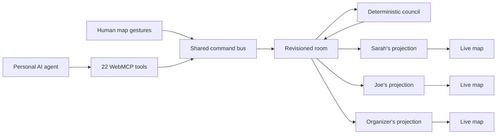

<p align="center">
  <picture>
    <source media="(prefers-color-scheme: dark)" srcset="docs/design/brand/spokes-lockup-dark.svg">
    
  </picture>
</p>

<p align="center">
  <strong>Find the one place everyone can say yes to, without making everyone explain why.</strong>
</p>

<p align="center">
  A shared map where people and their personal AI agents negotiate requirements,
  resolve conflicts, and agree on where to meet.
</p>

<p align="center">
  <a href="docs/DEMO-RUNBOOK.md"><strong>Demo runbook</strong></a> ·
  <a href="#run-the-demo">Run locally</a> ·
  <a href="docs/protocols/INTERACTION-AND-BINDING.md">WebMCP protocol</a> ·
  <a href="docs/PROJECT-STATUS.md">Project status</a>
</p>

<p align="center">
  
  
  <a href="LICENSE"></a>
</p>

Spokes gives a group one live room for choosing where to go. Each person, and
each person's AI agent, can state needs, inspect places, rule options out, and
agree on a destination. Sensitive requirements can affect the result without
being shown to the rest of the group.

## What happens in one room

1. Sarah adds a shared requirement for vegetarian options.
2. Joe adds a private lactose-free requirement. Joe sees its content; everyone
   else sees only "A private condition" and its effect on the candidate count.
3. Nothing satisfies the confirmed requirements. Spokes privately offers a
   measured way out: widen the search from 800 m to 1.2 km and recover four
   places.
4. The organizer confirms that change on the page. ChatGPT catches up with the
   room and proposes a destination through WebMCP.
5. Everyone accepts. The organizer settles the decision, and each participant
   receives a navigation handoff.

The room never identifies one person as "blocking" the group. It shows the
conflict, calculates possible adjustments, and asks the affected person for
consent.

## Why WebMCP belongs here

A map contains meaning that cannot be recovered reliably from pixels: what each
pin represents, which requirements removed it, what remains unknown, whose
private projection is being viewed, and what changed while an agent was away.

Spokes exposes that state through 22 typed WebMCP tools registered on
`document.modelContext`. Human gestures and agent tool calls enter the same
command bus and update the same room.

| Need | WebMCP behavior |
|---|---|
| Catch up after being away | `sync_session` returns a revision delta and participant-specific brief |
| Understand the map | Tools expose candidates, evidence, eligibility, scope, proposals, and arrival state |
| Act in the live room | Agents submit requirements, inspect places, propose destinations, respond, and plan arrival |
| Protect private context | Every participant receives a separately authorized server projection |
| Preserve human authority | An agent may stage sensitive changes; only the page receives the code needed to apply them |

The first `sync_session` response teaches the agent two application protocols:
`negotiation/v1` and `spatial-destination/v1`. The full tool and binding
contract is documented in
[Interaction and binding](docs/protocols/INTERACTION-AND-BINDING.md).

The web app remains fully usable when WebMCP is unavailable.

## Three privacy levels

| Level | Who receives the requirement | What the group sees |
|---|---|---|
| Shared | The room | Its owner, content, and effect |
| Application-private | The owner and coordinator | A redacted condition and aggregate effect |
| Agent-private | The owner's personal agent | Verdicts returned by the agent, never the hidden reason |

Application-private data is hidden from other participants and their agents,
not from the Spokes operator. Agent-private content stays with the personal
agent. See [Known limitations](docs/KNOWN-LIMITATIONS.md) for the complete
boundary.

## How it works



The council computes eligibility, detects impasses, and produces quantified
counterfactuals. Generative models may interpret language or evidence, but they
do not invent feasibility facts or decide whose requirement should yield.

Every accepted command becomes a revisioned event. The server projects that
event separately for each participant, so unauthorized fields never enter
another participant's HTTP response or WebSocket frame.

## Run the demo

Prerequisites:

- Docker with Compose
- GNU Make
- Node.js 24 and pnpm for the participant launcher and local tests

```bash
make doctor
make demo
pnpm exec node scripts/open-participants.mjs
```

`make demo` starts Postgres and the application, runs migrations, seeds the
three-person Berlin room, and prints its participant URLs. The launcher opens
Sarah and Joe in isolated Chromium contexts and prints the organizer URL.

Open the organizer URL in ChatGPT's in-app browser to use the WebMCP tools. For
the exact three-window sequence, follow the
[demo runbook](docs/DEMO-RUNBOOK.md).

No model API key is required for the deterministic room flow. Optional model
and search-provider keys enable the in-app natural-language and enrichment
paths.

For development with file watching:

```bash
make dev
```

The app is served at `http://127.0.0.1:4173`.

## Test

```bash
make test
```

The main suite covers:

- Protocol schemas, result budgets, and contract hashing
- Eligibility and quantified impasse resolution
- Privacy redaction at the HTTP and WebSocket boundaries
- Three-user API trajectories
- Three isolated browser contexts and the full product flow

Native WebMCP discovery and execution use a separate real-Chrome lane:

```bash
make test-native
```

That lane requires Chrome 149 or newer and an origin-trial token. See the
[deployment guide](docs/DEPLOY-COOLIFY.md).

## Repository structure

| Path | Responsibility |
|---|---|
| `apps/web` | React, Vite, MapLibre, participant views, and WebMCP registration |
| `apps/server` | Fastify API, WebSockets, command bus, projections, council, and event log |
| `packages/contracts` | TypeBox schemas, commands, results, protocol manifest, and place data |
| `tests/unit` | Contracts, eligibility, redaction, evidence, and UI behavior |
| `tests/api` | Three-user API and privacy-at-the-wire scenarios |
| `tests/e2e` | Multi-context browser flows and native WebMCP |
| `scripts` | Demo launcher, recording, data preparation, and operational tools |

## Data and evidence

Rooms use bounded OpenStreetMap-backed place pools for Berlin Mitte and San
Francisco SoMa. Spokes keeps verified facts, informed estimates, disputed
claims, and missing data separate. An unknown attribute does not silently
disqualify a place.

Agents can investigate missing facts and attach an attestation with its source.
Existing verified data is marked disputed rather than silently overwritten.

Read [Data quality](docs/DATA-QUALITY.md) and
[Enrichment sources](docs/ENRICHMENT-SOURCES.md) for coverage measurements,
provider decisions, provenance, caching, and known gaps.

## Documentation

- [Product concept](docs/PRODUCT-CONCEPT.md)
- [Demo runbook](docs/DEMO-RUNBOOK.md)
- [System architecture](docs/SYSTEM-ARCHITECTURE.md)
- [WebMCP interaction and binding](docs/protocols/INTERACTION-AND-BINDING.md)
- [Data quality](docs/DATA-QUALITY.md)
- [Known limitations](docs/KNOWN-LIMITATIONS.md)
- [Deployment](docs/DEPLOY-COOLIFY.md)
- [Current project status](docs/PROJECT-STATUS.md)

## Project status

Spokes is a WebMCP Challenge 2026 prototype with a complete three-person
vertical slice. It does not claim cryptographic secrecy from the application
operator, perfect protection from inference, exhaustive place coverage, or
background ChatGPT execution.

See [Project status](docs/PROJECT-STATUS.md) for the latest release gates and
remaining work.

## Contributing

Issues and pull requests are welcome. Please run `make test` before submitting
a change, and keep protocol changes synchronized with the generated contract
manifest.

If Spokes gives you an idea for another shared decision domain, open an issue.
The negotiation layer is intended to support scheduling, travel, purchasing,
and resource allocation by replacing the spatial adapter.

## License

Source code is available under the [MIT License](LICENSE).

The bundled OpenStreetMap-derived data remains subject to the Open Database
License. See
[packages/contracts/data/ATTRIBUTION.md](packages/contracts/data/ATTRIBUTION.md).
