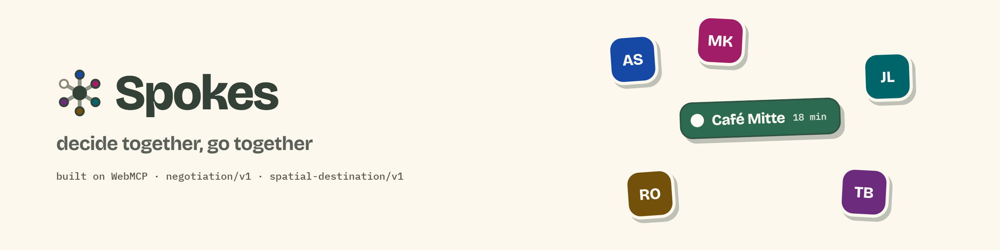
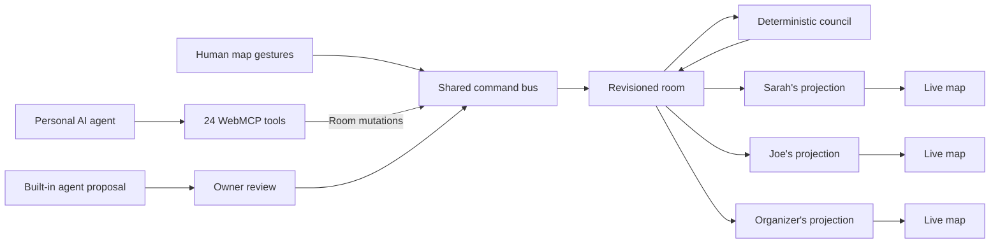

<p align="center">
  
</p>

<p align="center">
  A shared map where people and their personal AI agents negotiate requirements,
  resolve conflicts, and agree on where to meet.
</p>

<p align="center">
  <a href="docs/DEMO-RUNBOOK.md"><strong>Demo runbook</strong></a> ·
  <a href="#run-the-demo">Run locally</a> ·
  <a href="docs/protocols/INTERACTION-AND-BINDING.md">WebMCP protocol</a> ·
  <a href="docs/PROJECT-STATUS.md">Project status</a>
</p>

<p align="center">
  
  
  <a href="LICENSE"></a>
</p>

Spokes gives a group one live room for choosing where to go. Each person, and
each person's AI agent, can state needs, inspect places, rule options out, and
agree on a destination. Sensitive requirements can affect the result without
being shown to the rest of the group.

Start with a goal, review a plan of up to three stops, and invite each person
with their own link. Each settled choice opens the next step; the final choice
leads to navigation. The demo uses prepared Berlin and San Francisco data.

## What happens in one room

1. Sarah adds a shared requirement for vegetarian options.
2. Joe adds a private lactose-free requirement. Joe sees its content; the
   group's views show compatibility effects without the condition text.
3. If no place is confirmed to meet the active needs, Spokes can privately
   offer a measured adjustment, such as a wider search with a count of the
   places it would bring back.
4. The organizer confirms that change on the page. ChatGPT catches up with the
   room and proposes a destination through WebMCP.
5. Everyone is ready and has accepted or abstained, with no veto. The organizer
   settles the decision. After the last step, each participant can choose an
   arrival mode and open navigation.

Private text is omitted from peers' views; effects and ownership metadata can
still be visible. Shared stances and readiness can identify people. Adjustment
grants follow delegated authority, with page confirmation when required;
the organizer can also change shared scope directly.

## Why WebMCP belongs here

A map contains meaning that cannot be recovered reliably from pixels: what each
pin represents, which requirements removed it, what remains unknown, whose
private projection is being viewed, and what changed while an agent was away.

Spokes exposes compact views and actions through 24 typed WebMCP tools on
`document.modelContext`. Page gestures and agent room mutations enter the same
command bus. Registration starts at page load; browser support is
feature-detected.

| Need | WebMCP behavior |
|---|---|
| Catch up after being away | `sync_session` returns a revision delta and participant-specific brief |
| Understand the map | Tools return compact candidate/evidence summaries, eligibility, scope, and proposals; full details remain in the page |
| Act in the live room | Agents submit requirements, inspect places, propose destinations, respond, and plan arrival |
| Protect private context | Every participant receives a separately authorized server projection |
| Separate staging from commitment | Agreement and over-bound grants need a confirmation code delivered on the participant's authenticated realtime channel |

Before opening a room, an agent can call `describe_regions` and `open_room`.
Once authenticated, `sync_session({})` teaches it two application protocols:
`negotiation/v1` and `spatial-destination/v1`. The full tool and binding
contract is documented in
[Interaction and binding](docs/protocols/INTERACTION-AND-BINDING.md).

The web app remains fully usable when WebMCP is unavailable.

The built-in tool-calling agent proposes exact changes for its participant to
approve. These review cards expire after five minutes. External WebMCP agents
use their participant's authority directly. Page confirmation is an authority
boundary, not cryptographic proof that a person clicked.

## Three privacy levels

| Level | Who receives the requirement | What the group sees |
|---|---|---|
| Shared | The room | Its owner, content, and effect |
| Application-private | The application server and owner; model evaluation can receive the criterion | Redacted content, with ownership metadata and compatibility effects |
| Agent-private | An external agent can retain it; the built-in agent uses server memory and tool-less models | Declarations and verdict effects, without the condition text |

Application-private data reaches durable application storage. The built-in
agent's agent-private text is interpreted and screened on the server/model
path but omitted from requirement/event records and the tool-calling model's
context. A restart loses the held text. Neither mode promises anonymous
ownership, end-to-end encryption, or protection from small-group inference.
See [Known limitations](docs/KNOWN-LIMITATIONS.md) for the complete boundary.

## How it works



The council computes eligibility, detects impasses, and produces quantified
counterfactuals. Models interpret language and source evidence; accepted claims
retain provenance and confidence and can still be wrong. Deterministic rules
classify places, while participants decide whether to change their needs or
agree on a destination. Agreement does not certify that every need is met.

Commands can append several revisioned events. The server projects them
separately for each participant, omitting unauthorized private content.
No-op commands and idempotency replays need not create another event sequence.

## Run the demo

Prerequisites:

- Docker with Compose
- GNU Make
- Node.js 24 and pnpm for the participant launcher and local tests

```bash
pnpm install --frozen-lockfile
make doctor
make demo
pnpm exec node scripts/open-participants.mjs
```

`make demo` starts Postgres and the application, runs migrations, seeds the
three-person Berlin room, and prints its participant URLs. The launcher opens
Sarah and Joe in isolated Chromium contexts and prints the organizer URL.

The seeded member links are local development fixtures; production uses
one-person browser-bound join links. Open the organizer URL in a supported
WebMCP browser/agent host for native tools. For the three-window sequence, follow the
[demo runbook](docs/DEMO-RUNBOOK.md).

Direct room controls require no model key. Optional model and search-provider
keys enable language help and additional enrichment; website/open-data
lookups can still run without model credentials.

For development with file watching:

```bash
make dev
```

The app is served at `http://127.0.0.1:4173`.

To warm reusable provider data before a demo:

```bash
pnpm prepopulate --area berlin-mitte --dry-run
pnpm prepopulate --area berlin-mitte
```

Use the demo's database and provider settings, with migrations applied. The CLI
also supports `sf-soma`, smaller place limits and selected source passes.
See [Prepare a demo region](docs/PREPOPULATE.md) for setup and cache lifetimes.

## Test

```bash
make test
```

The main suite covers:

- Protocol schemas, result budgets, and contract hashing
- Eligibility and quantified impasse resolution
- Privacy redaction at the HTTP and WebSocket boundaries
- Three-user API trajectories
- Selected browser scenarios with isolated participant contexts

Native WebMCP discovery and execution use a separate real-Chrome lane:

```bash
make test-native
```

The current test harness requires real Chrome 149+ and an origin-trial token
for its test origin. A passing local shim is not native-agent proof. Use an
isolated migrated database; see [validation commands](docs/PROJECT-STATUS.md#run-and-validate)
and the [deployment guide](docs/DEPLOY.md).

## Repository structure

| Path | Responsibility |
|---|---|
| `apps/web` | React, Vite, MapLibre, participant views, and WebMCP registration |
| `apps/server` | Fastify API, WebSockets, command bus, projections, council, and event log |
| `packages/contracts` | TypeBox schemas, commands, results, protocol manifest, and place data |
| `tests/unit` | Contracts, eligibility, redaction, evidence, and UI behavior |
| `tests/api` | Three-user API and privacy-at-the-wire scenarios |
| `tests/e2e` | Multi-context browser flows and native WebMCP |
| `scripts` | Demo launcher, recording, data preparation, and operational tools |

## Data and evidence

Rooms use bounded OpenStreetMap-backed place pools for Berlin Mitte and San
Francisco SoMa. Spokes keeps verified facts, informed estimates, disputed
claims, and missing data separate. An unknown attribute does not silently
disqualify a place.

Agents can investigate missing facts and attach an attestation with its source.
Participants can also confirm facts for their room. Contradictory person
evidence can mark a verified source record disputed. These contributions do
not certify the venue for every other room.

Read [Data quality](docs/DATA-QUALITY.md) and
[Enrichment sources](docs/ENRICHMENT-SOURCES.md) for coverage measurements,
provider decisions, provenance, caching, and known gaps.

## Documentation

- [Documentation index and document roles](docs/README.md)
- [Current product brief](PRODUCT.md)
- [Demo runbook](docs/DEMO-RUNBOOK.md)
- [System architecture](docs/SYSTEM-ARCHITECTURE.md)
- [WebMCP interaction and binding](docs/protocols/INTERACTION-AND-BINDING.md)
- [Data quality](docs/DATA-QUALITY.md)
- [Known limitations](docs/KNOWN-LIMITATIONS.md)
- [Deployment](docs/DEPLOY.md)
- [Current project status](docs/PROJECT-STATUS.md)

## Project status

Spokes is a WebMCP Challenge 2026 prototype with guest joining, sequential
plans, private needs, evidence lookup, and staged group agreement. Current
limits include no participant removal or room closing, no soft-preference
ranking, and process-local live coordination. Provider availability and native
agent compatibility require checks against the build and environment in use.

See [Project status](docs/PROJECT-STATUS.md) for the latest release gates and
remaining work.

## Contributing

Issues and pull requests are welcome. Please run `make test` before submitting
a change, and keep protocol changes synchronized with the generated contract
manifest.

If Spokes gives you an idea for another shared decision domain, open an issue.
The negotiation concepts are intended to transfer to other shared decisions;
the current engine still contains spatial logic and has not been extracted
into a separately reusable domain-independent package.

## License

Source code is available under the [MIT License](LICENSE).

The bundled OpenStreetMap-derived data remains subject to the Open Database
License. See
[packages/contracts/data/ATTRIBUTION.md](packages/contracts/data/ATTRIBUTION.md).
