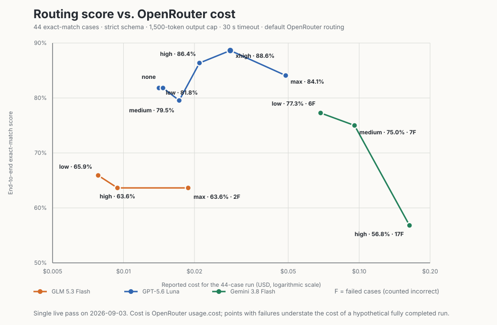
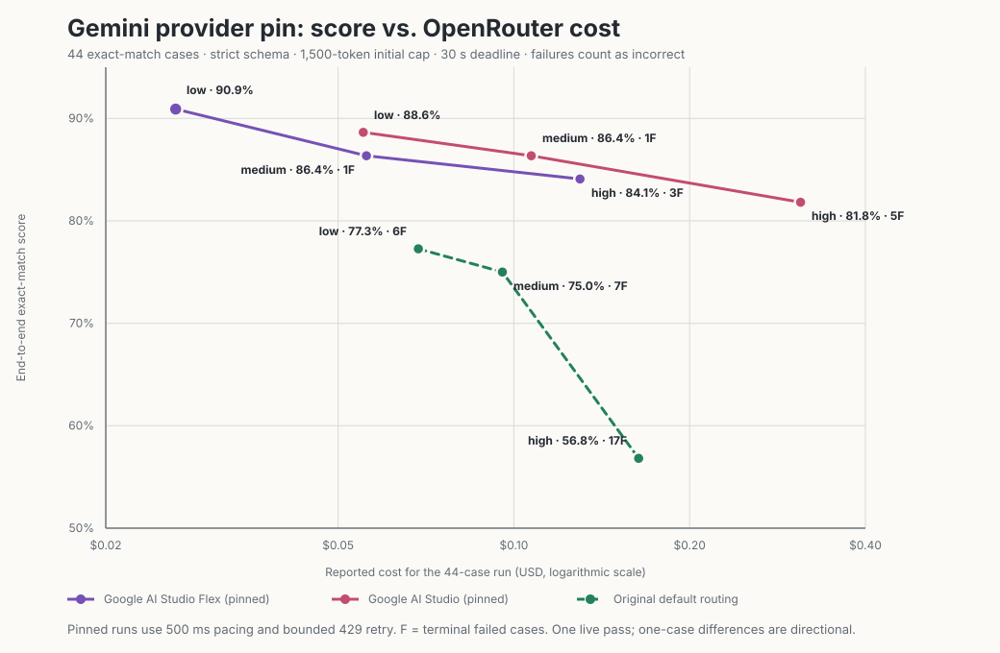

# OpenRouter model-effort benchmark — 2026-09-03

## Result

Under default OpenRouter routing, GPT-5.6 Luna is the clear quality winner for
this latency-bound structured-routing workload. `xhigh` produced the top
score, 39/44 (88.64%), at $0.02839.
Luna `none` is the efficient production choice: 36/44 (81.82%) at $0.01414,
with no failures. GLM-5.3-Flash did not improve with more reasoning. Gemini
3.8 Flash was accurate when it completed, but mandatory reasoning increasingly
exceeded the application's 30-second request budget.

A route-controlled follow-up changes the Gemini conclusion: pinned Google AI
Studio Flex at `low` scored 40/44 (90.91%) for $0.02635, the best observed
score-versus-cost point. Because this is one stochastic pass and only one case
above Luna `xhigh`, the ranking needs repeated runs before a production switch.

## Measurements

| Model | Effort | Exact score | Failures | Score among completed cases | Input tokens | Output tokens | Reasoning tokens | Reported cost |
|---|---:|---:|---:|---:|---:|---:|---:|---:|
| GLM-5.3-Flash | low | 29/44 (65.91%) | 0 | 65.91% | 33,507 | 6,156 | 541 | $0.00780 |
| GLM-5.3-Flash | high | 28/44 (63.64%) | 0 | 63.64% | 29,649 | 9,956 | 3,177 | $0.00943 |
| GLM-5.3-Flash | max | 28/44 (63.64%) | 2 | 66.67% | 29,015 | 28,932 | 22,085 | $0.01881 |
| GPT-5.6 Luna | none | 36/44 (81.82%) | 0 | 81.82% | 41,114 | 4,927 | 0 | $0.01414 |
| GPT-5.6 Luna | low | 36/44 (81.82%) | 0 | 81.82% | 41,114 | 5,404 | 584 | $0.01471 |
| GPT-5.6 Luna | medium | 35/44 (79.55%) | 0 | 79.55% | 41,114 | 7,509 | 2,705 | $0.01723 |
| GPT-5.6 Luna | high | 38/44 (86.36%) | 0 | 86.36% | 41,114 | 10,656 | 5,533 | $0.02101 |
| GPT-5.6 Luna | xhigh | **39/44 (88.64%)** | 0 | **88.64%** | 41,114 | 16,809 | 11,683 | $0.02839 |
| GPT-5.6 Luna | max | 37/44 (84.09%) | 0 | 84.09% | 44,841 | 33,190 | 28,241 | $0.04880 |
| Gemini 3.8 Flash | low | 34/44 (77.27%) | 6 | 89.47% | 49,591 | 8,382 | 2,539 | $0.06863 |
| Gemini 3.8 Flash | medium | 33/44 (75.00%) | 7 | 89.19% | 45,869 | 16,313 | 10,326 | $0.09558 |
| Gemini 3.8 Flash | high | 25/44 (56.82%) | 17 | 92.59% | 39,824 | 35,654 | 31,553 | $0.16357 |

The machine-readable measurements are in
[`openrouter-effort-benchmark-2026-09-03.csv`](./openrouter-effort-benchmark-2026-09-03.csv).

## Gemini provider-pin follow-up

The same three Gemini effort levels were rerun with fallback disabled against
the exact `google-ai-studio/flex` endpoint tag and against the non-Flex
`google-ai-studio` provider. The request tier was `flex` and `default`,
respectively. Successful responses reported the requested tier on every call.

| Pinned route | Effort | Exact score | Failures | Score among completed | Calls | Input tokens | Output tokens | Reasoning tokens | Reported cost |
|---|---:|---:|---:|---:|---:|---:|---:|---:|---:|
| Google AI Studio Flex | low | **40/44 (90.91%)** | 0 | 90.91% | 44 | 30,422 | 7,969 | 1,533 | **$0.02635** |
| Google AI Studio Flex | medium | 38/44 (86.36%) | 1 | 88.37% | 45 | 31,114 | 23,594 | 16,925 | $0.05591 |
| Google AI Studio Flex | high | 37/44 (84.09%) | 3 | 90.24% | 53 | 36,642 | 61,908 | 56,009 | $0.12982 |
| Google AI Studio | low | 39/44 (88.64%) | 0 | 88.64% | 44 | 30,422 | 8,640 | 2,297 | $0.05522 |
| Google AI Studio | medium | 38/44 (86.36%) | 1 | 88.37% | 45 | 31,114 | 22,341 | 15,599 | $0.10711 |
| Google AI Studio | high | 36/44 (81.82%) | 5 | 92.31% | 59 | 40,808 | 74,436 | 67,885 | $0.30974 |

The locked runs were sequential within each provider, with 500 ms between
cases and bounded exponential retry for upstream 429s. Flex encountered one
429 across its final runs; standard AI Studio encountered 15, including 14 at
`high`. All terminal failures were two consecutive `max_output_tokens`
incompletions, not routing fallbacks. The initial concurrent Flex attempt was
excluded because OpenRouter identified its 429s as Google AI Studio shared-pool
rate limits.

## Method

- Corpus: all 44 `preparse == "none"` entries in
  `tests/fixtures/nl-corpus.jsonl`. A result passes only when intent, mapped
  need payloads, and clarification behavior exactly match the fixture.
- Wire: OpenRouter's Responses API, one sequential request per case, strict
  `understanding` JSON schema, `max_output_tokens: 1500`, `service_tier:
  default`, and the application's 30-second deadline. The provider-pin
  follow-up changes only routing/tier and adds the pacing/backoff noted above.
- Efforts: the levels exposed by OpenRouter's live model metadata on the test
  date: GLM `low/high/max`, Gemini `low/medium/high`, and Luna
  `none/low/medium/high/xhigh/max`.
- Cost: the sum of OpenRouter's returned `usage.cost`, not a price estimate.
  Reasoning tokens are included in output tokens and cost.
- Routing: OpenRouter's default routing was left enabled, matching the
  deployment default at the start of the run. This is a production comparison,
  not a controlled provider-host experiment. The new `OPENROUTER_PROVIDERS`
  seam can pin a host for a follow-up provider comparison.
- Run count: one pass. Treat one-case differences as directional, not
  statistically conclusive.

## Controlled output-format check

The original GLM question also needs a format control because the routing
prompt relies on the supplied schema for field definitions. These three runs
pin OpenRouter to Together, hold GLM at `low`, and change only the output
format:

| Format | Exact score | Input tokens | Output tokens | Reported cost |
|---|---:|---:|---:|---:|
| Strict JSON schema | **32/44 (72.73%)** | 27,720 | 6,372 | $0.00734 |
| JSON object, schema removed | 7/44 (15.91%) | 27,720 | 3,484 | $0.00590 |
| Prompt-only JSON, schema removed | 5/44 (11.36%) | 27,720 | 3,522 | $0.00592 |

This does not measure generic JSON syntax skill: removing the schema also
removes the application's detailed output contract. It shows that this prompt
cannot safely replace strict structured output with a cheaper format mode.
Pinning Together also scored four cases above GLM `low` under free provider
routing, but a single stochastic pass is not enough to attribute that gap to
the provider rather than run variance.

## Findings

1. **Luna `none` dominates Luna `low` and `medium`.** It ties `low`, beats
   `medium`, costs least, and had no failures. Higher reasoning begins paying
   off at `high`; `xhigh` adds three correct cases over `none` for another
   $0.01426 per corpus. `max` regresses and costs 72% more than `xhigh`.
2. **More reasoning does not repair GLM for this task.** `high` and `max` each
   lost one exact match versus `low`. `max` used 22,085 reasoning tokens and
   cost 2.41 times `low` while also producing two failures.
3. **Gemini is constrained by the application deadline, not raw answer quality.**
   Completed-case accuracy was 89.47%, 89.19%, and 92.59% as effort increased,
   but failures rose from 6 to 17. Its end-to-end score therefore fell while
   reported cost rose. A longer-timeout background workload may rank it very
   differently; it is unsuitable for the current 30-second interactive route.
4. **General benchmarks do not predict this workload.** OpenRouter's model page
   says GLM-5.3-Flash supports JSON output but does not guarantee JSON-schema
   enforcement at the model level. Endpoint metadata shows strict-output
   support varies by host. Luna and Gemini advertise native structured outputs.
   The application is measuring short multilingual classification plus exact
   schema adherence, not long-horizon coding or agent performance.
5. **The strict schema is part of the prompt.** JSON-object and prompt-only
   modes collapse on the same pinned endpoint. Keep both the schema and
   `provider.require_parameters: true`.
6. **Google AI Studio Flex `low` is the strongest pinned Gemini setting.** It
   beat Flex `medium` and `high` on score, failures, token use, and cost. It
   also edged standard AI Studio `low` by one case for less than half the cost.
   Higher effort caused repeated output-cap incompletions; the extra successful
   calls are billed, explaining why `high` cost grew faster than its 44 cases.

## Configuration recommendation

- Set `LLM_MODEL_ROUTE=openai/gpt-5.6-luna`. The current hard-coded `low`
  effort scored the same as `none` and is immediately deployable. If effort
  becomes model-aware and configurable, preserve Luna's real `none` setting
  for the cheapest route; the current adapter rewrites `none` to `low` to
  accommodate mandatory-reasoning models. Use `xhigh` only if the extra three
  correct cases justify roughly doubling the corpus cost.
- Do not increase GLM-5.3-Flash route effort above `low`.
- Treat pinned `google-ai-studio/flex` at Gemini `low` as the leading candidate
  for a repeated evaluation. It was the best observed point, but Flex is a
  shared-capacity tier and produced heavy 429 throttling under three concurrent
  benchmark streams. Keep retry/backoff and decide whether that capacity model
  is acceptable for the interactive route.
- Do not use Gemini `medium` or `high` for this route. Both are dominated by
  `low`; raising the output cap would reduce incompletions but increase their
  already much higher cost and latency.
- Keep `provider.require_parameters: true` for strict-schema calls. For any GLM
  follow-up, pin one structured-output-capable provider so provider variation
  does not confound effort results.

## Sources

- [OpenRouter reasoning controls](https://openrouter.ai/docs/guides/best-practices/reasoning-tokens)
- [OpenRouter provider routing](https://openrouter.ai/docs/guides/routing/provider-selection)
- [OpenRouter service tiers](https://openrouter.ai/docs/guides/features/service-tiers)
- [OpenRouter structured outputs](https://openrouter.ai/docs/guides/features/structured-outputs)
- [GLM-5.3-Flash on OpenRouter](https://openrouter.ai/z-ai/glm-5.3-flash)
- [Gemini 3.8 Flash on OpenRouter](https://openrouter.ai/google/gemini-3.8-flash)
- [GPT-5.6 Luna in official OpenAI documentation](https://developers.openai.com/api/docs/models/gpt-5.6-luna)
- [Gemini 3.8 Flash in official Google documentation](https://ai.google.dev/gemini-api/docs/models/gemini-3.8-flash)
